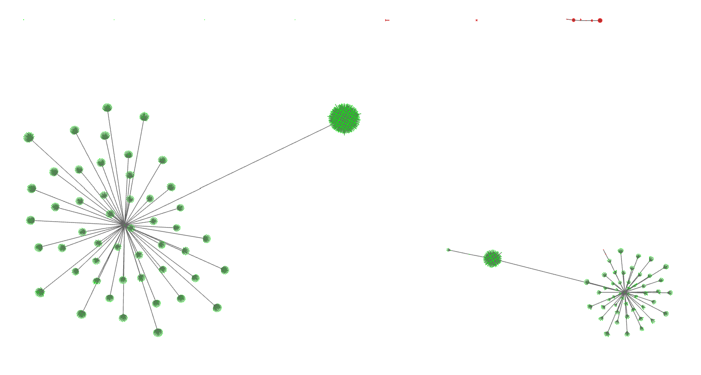
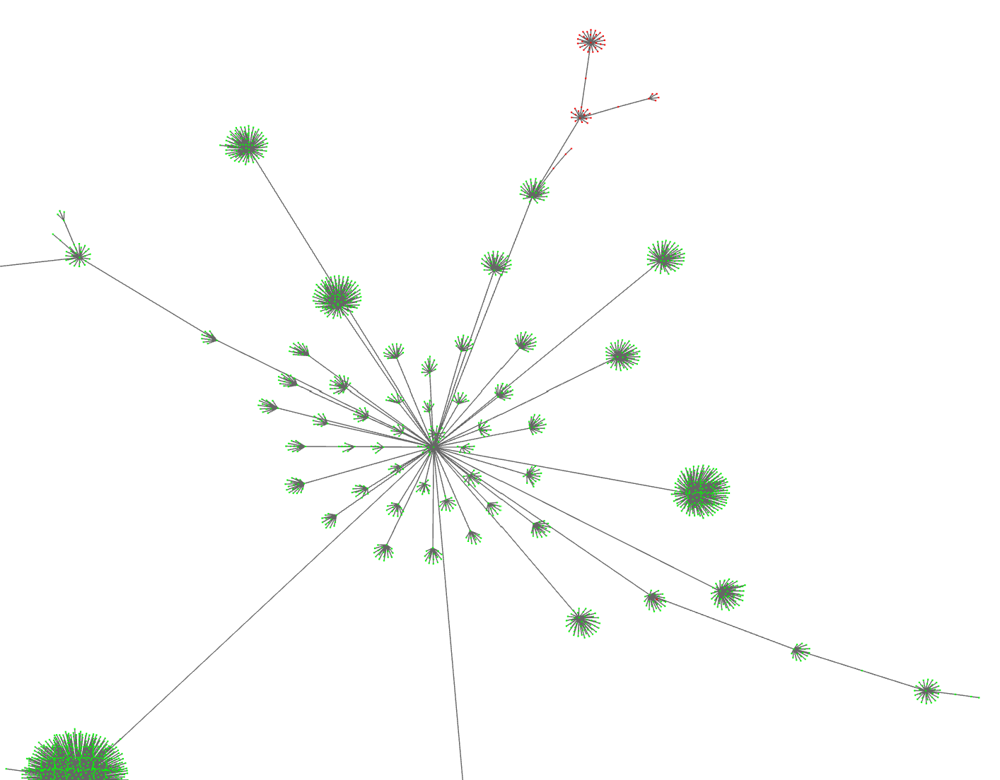
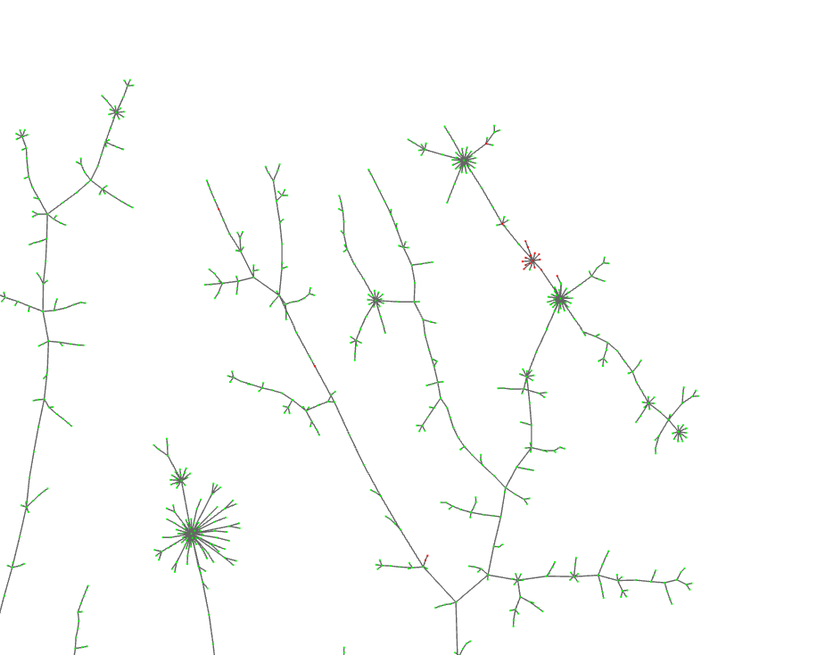

### TLS similarity mapped using 50k neighbours and 128 hash cycles
#### Malicious nodes are seen as outliers

### TLS similarity mapped using 50k neighbours and 2048 hash cycles
#### Malicious nodes are grouped tightly.

### Small shot of the http header plot
#### Initial results, not promising but clusters are forming @ 4096 hash cycles

