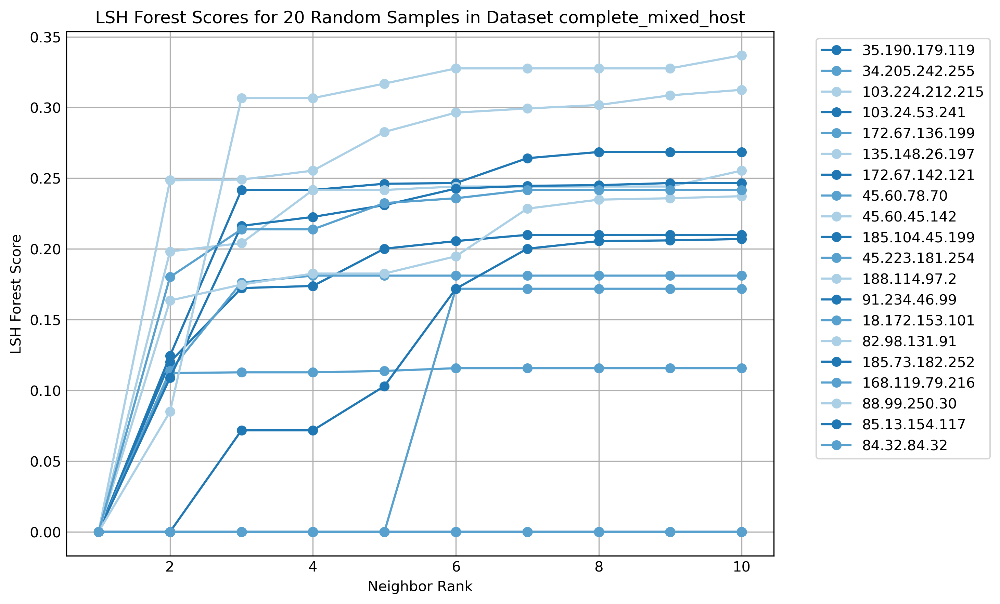

## TLS Similarity Mapping
The process of creating similarity mapping has a dependancy on [MassDNS](https://github.com/blechschmidt/massdns) and the [ActiveTLS goscanner](https://github.com/tumi8/goscanner). The commands for these two tools are as follows:

Provide massdns with a list of domains - domains.txt:

`bin/massdns -r lists/resolvers.txt domains.txt -q -o J | jq -r '[.name, .data.answers[-1].data] | @csv' | tr -d '"' | awk -F, '{print $2","$1}' | awk -F, '$1!=""' > domains.csv`

Create the client hello to domain input list to a specified directory:

`./goscanner create-ch-input --ch-dir active-tls-fingerprinting/client-hellos/ --input domains.csv | shuf > domains_input.csv`

Run the goscanner:

`./goscanner --config=final.conf -v`

Create the fingerprint file to be used with the enrichment script:

`./goscanner generate-fingerprints --scanner-dir ./tls-scanner-output_final --ch-dir ./active-tls-fingerprinting/client-hellos/`

An sample config file:

```; Input file with IP,domain,client hello tuples
input-file = "short_input.csv"
; Output directory (must not exist as scanner will refuse to override existing output)
output = "tls-scanner-output_final"
; Limit the requests per second to reduce load on targets
qps = 70
; Store the HTTP Header (not necessary for fingerprinting)
; Enable extended TLS output to collect the fingerprintable information
tls-extended-output = true
; Provide the Client Hello Directory
client-hello-dir = "active-tls-fingerprinting/client-hellos/"
; use the TLS and HTTP function of the scanner
scans = "tls"
```
### Run the enrichmment.py script
`python3 enrichment.py -i dataset -l 3 -o final_scans -f fingerprints.csv -c`

There are multiple options for building the enriched fingerprint:

<table>
    <tr>
        <td width="5%">-i</td>
        <td>Argument that provides the value to be entered into the input_list column. This is the source of the data set such as 'good' or 'tranco' for example.</td>
    </tr>
  <tr>
        <td width="5%">-l</td>
        <td>Argument that provides the value which will be entered into the 'label' column. In these example 0 is always good, 1 is always bad and 2 is unknown. There can be as many labels as desired but this will effect the colour scheme of the final plot and the legend will have to be amended.</td>
    </tr>
  <tr>
        <td width="5%">-o</td>
        <td>Specifies the output directory of the final csv file. The default is just /tmp</td>
    </tr>
  <tr>
        <td width="5%">-f</td>
        <td>The file containing the fingerprints generated by the ActiveTLS stack tool. The default is fingerprints.csv in the local directory.</td>
    </tr>
  <tr>
        <td width="5%">-c</td>
        <td>This option specifies if the process should gather HTTP Headers. If you do not choose to gather headers, you will not be able to use them in the plot stage. The HTTP Headers will make HEAD requests to 100 domains at a time and can be slow.</td>
    </tr>
</table>

The fianl output is a .csv file with multiple rows of fingerprint data:

ip	server_name	version	ciphers	ext	enc_ext	cert_ext	alerts	fingerprint	input_list	label	AS	http_headers	filtered_http_headers	filtered_http_headers_hash	final_fp
127.0.0.1	example.com	771	4865_4866_49200_49249_52392	0_1_11_16_23_29_35_43_65281	0_10_16		40_70_80	0001d7a1246f7be3e004ebd784c88a7caedcd6872b2d6f8dd88a09f48b159047	tranco	0	7859	{'Date': 'Mon, 24 Jun 2024 20:38:21 GMT', 'Server': 'Apache', 'Location': 'https://www.example.com/', 'Content-Type': 'text/html; charset=iso-8859-1'}	Date Server:Apache Location Content-Type	1027326230	0001d7a1246f7be3e004ebd784c88a7caedcd6872b2d6f8dd88a09f48b1590471027326230
### Run the binary_plot.py script
`python3 binary_plot.py -f enriched_fingerprints.csv -c -s`

<table>
    <tr>
        <td width="5%">-c</td>
        <td>If the input fingeprint file contains HTTP Headers, this option means those headers will be included in the vector creation and similarity mapping. </td>
    </tr>
  <tr>
        <td width="5%">-f</td>
        <td>Location of the input fingerprint file, default is current directory fingerprint.csv</td>
    </tr>
  <tr>
        <td width="5%">-s</td>
        <td>Used to run the fearun similrity plot intreactively as a web server on http://localhost:8080 this means nodes can be investigated automatically in virus total by double clicking on them.</td>
    </tr>
  <tr>
        <td width="5%">-a</td>
        <td>Conducts analysis on the fingeprints and similarity calculations. This produces two .png files in the current directory. Enables exploration of the granularity and similarity calculations.</td>
    </tr>
</table>

### Example output from the analysis on fingerprint granularity
The plot shows the comparison between the original ActiveTLS stack fingerprint vs the new fingerprint.


### Example output from analysis on the similarity. 

The C bindings within TMAP provide numerous functions to enable Jaccard distance evaluation and k-nearest neighbour retrieval. The LSH forest can be queried using the query_linear_scan_by_id functionality which retrieves the k-nearest neighbours to any given id by using a combination of LSH forest traversal and linear scan. This provides an excellent way to visualise and evaluate the success and stability of the distance calculations. In the case of the TMAP functionality, the closer the distance to the given ID, the lower the distance value, with an exact match being represented as 0.0. Thes example output is 20 random ID’s queried for their nearest 10 neighbours with the distance from the origin of 0.0 plotted against their k-nearest neighbour. 


### Example similarity mapping using malicious domains.

One use case is identiying malicious applications from their similarity based purely on their external features. This example plot is based on the enriched TLS with HTTP header features with a dimensionality of 4475 x 306. Clear clusters can be seen forming across applications, making it a viable approach to determining the actual malware family of plotted domains.

